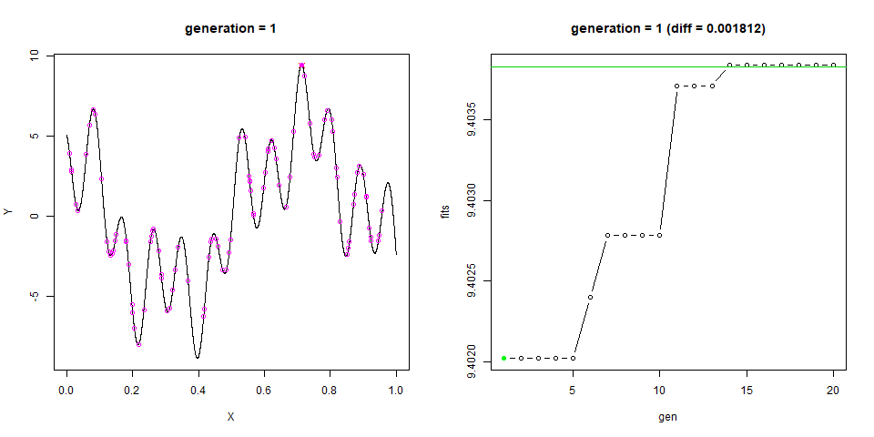

# problem setting

## maximize the fitness function




```r
fitnessCurve <- function(x){
  return(
    2 * sin(29 * x - 1) + 5 * sin(1 - 8 * x) + 3 * sin(1 - 70 * x)
  )
}
# example
system.time({
  X <- seq(0,1,1e-7)
  Y <- fitnessCurve(X)
  print( max.x <- X[which.max(Y)])
  print( max.y <- max(Y))
  
})
```

```
## [1] 0.712669
## [1] 9.403835
```

```
##    user  system elapsed 
##    1.47    0.14    1.60
```

```r
plot(x=X, y=Y, type="l")
points(x=max.x, y = max.y, col="red", pch=16)
```

<!-- -->

# individual


## encoding 

### genetic representation


```r
individual <- function(N){
  sample(c(0,1), N, replace=TRUE)
}
# example
(ind1 <- individual(20))
```

```
##  [1] 1 1 1 1 1 1 0 1 0 0 0 1 1 1 0 0 0 1 1 0
```

### decode to phenotype (-> fitness evaluation)

*phenotype* is input to fitness function.


```r
bin2dec <- function(chrom, norm = TRUE){
  stopifnot(all(chrom %in% c(0,1)) == TRUE)
  dec <- sum(2^(1:length(chrom) -1) * chrom)
  if(norm == TRUE){
    dec <- dec / sum(2^(1:length(chrom) -1))
  }
  
  return(dec)
}
# example
(ind1 <- individual(20))
```

```
##  [1] 1 0 0 0 1 0 0 1 0 0 1 1 0 1 0 0 1 0 0 1
```

```r
(pheno <- bin2dec(ind1))
```

```
## [1] 0.573381
```

```r
fitnessCurve(pheno)
```

```
## [1] -0.659409
```

## genetic operator

### crossover 

In this case, single-point-crossover is applied.


```r
crossover <- function(p1, p2, show.pos = FALSE){
  len_chrom <- length(p1)
  stopifnot(len_chrom == length(p2))
  
  # position at crossover
  at <- sample(len_chrom - 1 , 1)
  
  child <- c(p1[1:at], p2[(at+1):len_chrom])
  if(show.pos){
    child <- list(at = at, p1 = p1, p2 = p2, chrom = child)
  }
  return(child)
}
# example
(chr1 <- rep(1, 10))
```

```
##  [1] 1 1 1 1 1 1 1 1 1 1
```

```r
(chr2 <- rep(0, 10))
```

```
##  [1] 0 0 0 0 0 0 0 0 0 0
```

```r
crossover(chr1, chr2, show.pos = TRUE)
```

```
## $at
## [1] 4
## 
## $p1
##  [1] 1 1 1 1 1 1 1 1 1 1
## 
## $p2
##  [1] 0 0 0 0 0 0 0 0 0 0
## 
## $chrom
##  [1] 1 1 1 1 0 0 0 0 0 0
```

```r
crossover(chr1, chr2, show.pos = FALSE)
```

```
##  [1] 1 1 1 1 1 1 0 0 0 0
```

### mutation

In this case, single-point-mutation (bit flipping) is applied.


```r
mutation <- function(chrom, mutate.prob){
  stopifnot(all(chrom %in% c(0,1)) == TRUE,
            !missing(mutate.prob))
  
  # position at mutation
  at <- which(runif(length(chrom)) < mutate.prob)
  chrom[at] <- 1 - chrom[at]
  return(chrom)
}
# example
chr3 <- rep(1, 100)
mutation(chr3, 0.05)
```

```
##   [1] 1 1 1 1 1 1 1 1 1 1 1 1 1 1 1 1 1 1 1 1 1 1 1 1 1 1 1 1 1 1 1 1 1 0 1
##  [36] 1 1 1 0 1 1 1 1 1 1 1 1 1 1 0 1 1 0 1 1 1 1 1 1 1 1 1 1 1 1 1 1 1 1 1
##  [71] 1 1 1 1 1 1 1 1 1 0 0 1 1 1 1 1 1 1 1 1 1 1 1 1 1 1 1 1 1 1
```


# population

## simple procedure

init 1st generation -> 2nd generation.


```r
GEN_MAX     = 15  # number of generation
POP_SIZE    = 10  # population size
CHROM_SIZE  = 64   # size of problem
N_ELITE     = 5   # number of elite individual for next chromration
N_TOURNAMEST= 5   # number of individual for tournament selection
MUTATE_PROB = 0.05 # mutation rate

population <- tibble(
chrom = foreach(i = 1:POP_SIZE) %do% individual(CHROM_SIZE))

population$pheno <- sapply(population$chrom, bin2dec)
population$fits  <- sapply(population$pheno, fitnessCurve)

population %<>% arrange(desc(fits))

# Preserve elite individuals
nextInd.elite <- population %>% head(N_ELITE)
nextInd.elite %>% head %>% print()
```

```
## # A tibble: 5 x 3
##   chrom        pheno   fits
##   <list>       <dbl>  <dbl>
## 1 <dbl [64]> 0.00543  4.34 
## 2 <dbl [64]> 0.0223   1.37 
## 3 <dbl [64]> 0.113    0.192
## 4 <dbl [64]> 0.943   -1.84 
## 5 <dbl [64]> 0.462   -2.24
```

```r
# Generate new children
# tournament selection -> crossover
nextChrom <- foreach(i = (N_ELITE+1):NROW(population)) %do% {
  parents <- population %>%
    sample_n(N_TOURNAMEST) %>%
    arrange(desc(fits)) %>%
    head(2)
  crossover(parents$chrom[1] %>% unlist,
            parents$chrom[2] %>% unlist)
}

# mutation
nextInd.gen <- tibble(
  chrom = lapply(nextChrom, mutation, mutate.prob = MUTATE_PROB))

nextInd.gen$pheno <- sapply(nextInd.gen$chrom, bin2dec)
nextInd.gen$fits  <- sapply(nextInd.gen$pheno, fitnessCurve)

nextGen.all <- rbind(nextInd.elite, nextInd.gen) %>%
  arrange(desc(fits))

nextGen.all
```

```
## # A tibble: 10 x 3
##    chrom        pheno   fits
##    <list>       <dbl>  <dbl>
##  1 <dbl [64]> 0.00543  4.34 
##  2 <dbl [64]> 0.597    1.60 
##  3 <dbl [64]> 0.0222   1.38 
##  4 <dbl [64]> 0.0223   1.37 
##  5 <dbl [64]> 0.113    0.192
##  6 <dbl [64]> 0.147   -1.47 
##  7 <dbl [64]> 0.944   -1.73 
##  8 <dbl [64]> 0.943   -1.84 
##  9 <dbl [64]> 0.183   -1.96 
## 10 <dbl [64]> 0.462   -2.24
```


## functionize

### initialize 1st generation  


```r
initPopulation <- function(pop.size, chrom.size){
  stopifnot(!missing(pop.size), !missing(chrom.size))
  
  population <- tibble(
    chrom = foreach(i = 1:pop.size) %do% individual(chrom.size))
  
  population$pheno <- sapply(population$chrom, bin2dec)
  population$fits  <- sapply(population$pheno, fitnessCurve)
  
  return(population %>% arrange(desc(fits)))
}
# example
(pop <- initPopulation(pop.size = 20, chrom.size = 32))
```

```
## # A tibble: 20 x 3
##    chrom       pheno   fits
##    <list>      <dbl>  <dbl>
##  1 <dbl [32]> 0.0800  6.68 
##  2 <dbl [32]> 0.0724  6.23 
##  3 <dbl [32]> 0.690   5.78 
##  4 <dbl [32]> 0.780   5.59 
##  5 <dbl [32]> 0.537   5.29 
##  6 <dbl [32]> 0.537   5.26 
##  7 <dbl [32]> 0.625   4.65 
##  8 <dbl [32]> 0.764   3.67 
##  9 <dbl [32]> 0.635   3.56 
## 10 <dbl [32]> 0.819   2.61 
## 11 <dbl [32]> 0.669   0.970
## 12 <dbl [32]> 0.910   0.859
## 13 <dbl [32]> 0.162  -0.124
## 14 <dbl [32]> 0.172  -0.302
## 15 <dbl [32]> 0.126  -2.12 
## 16 <dbl [32]> 0.189  -3.49 
## 17 <dbl [32]> 0.299  -5.61 
## 18 <dbl [32]> 0.206  -7.23 
## 19 <dbl [32]> 0.392  -8.71 
## 20 <dbl [32]> 0.394  -8.82
```
### alternate to next generation


```r
alternate <- function(population, elite.size = 1, tournament.size = 4, mutate.prob = 0.01){
  stopifnot(!missing(population), 
            NROW(population) > elite.size )
  
  # Preserve elite individuals
  nextInd.elite <- population %>%
    arrange(desc(fits)) %>% 
    head(elite.size)
  
  # Generate new children
  # tournament selection -> crossover
  nextChrom <- foreach(i = (elite.size+1):NROW(population)) %do% {
    parents <- population %>% 
      sample_n(tournament.size) %>% 
      arrange(desc(fits)) %>% 
      head(2)
    crossover(parents$chrom[1] %>% unlist,
              parents$chrom[2] %>% unlist)
  }
  
  # mutation
  nextInd.gen <- tibble(
    chrom = lapply(nextChrom, mutation, mutate.prob = mutate.prob))
  
  nextInd.gen$pheno <- sapply(nextInd.gen$chrom, bin2dec)
  nextInd.gen$fits  <- sapply(nextInd.gen$pheno, fitnessCurve)
  
  nextGen.all <- rbind(nextInd.elite, nextInd.gen) %>% arrange(desc(fits))
  return(nextGen.all)
}
# example
(pop <- initPopulation(pop.size = 20, chrom.size = 32))
```

```
## # A tibble: 20 x 3
##    chrom       pheno   fits
##    <list>      <dbl>  <dbl>
##  1 <dbl [32]> 0.0953  4.85 
##  2 <dbl [32]> 0.744   4.69 
##  3 <dbl [32]> 0.0967  4.54 
##  4 <dbl [32]> 0.770   4.23 
##  5 <dbl [32]> 0.0523  2.35 
##  6 <dbl [32]> 0.0186  1.99 
##  7 <dbl [32]> 0.556   1.89 
##  8 <dbl [32]> 0.966   1.57 
##  9 <dbl [32]> 0.871   0.873
## 10 <dbl [32]> 0.668   0.838
## 11 <dbl [32]> 0.573  -0.627
## 12 <dbl [32]> 0.175  -0.647
## 13 <dbl [32]> 0.154  -0.724
## 14 <dbl [32]> 0.949  -1.07 
## 15 <dbl [32]> 0.256  -1.27 
## 16 <dbl [32]> 0.947  -1.38 
## 17 <dbl [32]> 0.929  -2.12 
## 18 <dbl [32]> 0.854  -2.12 
## 19 <dbl [32]> 0.226  -7.22 
## 20 <dbl [32]> 0.214  -8.00
```

```r
(alternate(pop))
```

```
## # A tibble: 20 x 3
##    chrom       pheno    fits
##    <list>      <dbl>   <dbl>
##  1 <dbl [32]> 0.0953  4.85  
##  2 <dbl [32]> 0.0953  4.85  
##  3 <dbl [32]> 0.770   4.23  
##  4 <dbl [32]> 0.519   4.04  
##  5 <dbl [32]> 0.754   3.56  
##  6 <dbl [32]> 0.0165  2.35  
##  7 <dbl [32]> 0.0523  2.35  
##  8 <dbl [32]> 0.0523  2.35  
##  9 <dbl [32]> 0.0171  2.24  
## 10 <dbl [32]> 0.0186  1.99  
## 11 <dbl [32]> 0.0503  1.96  
## 12 <dbl [32]> 0.556   1.89  
## 13 <dbl [32]> 0.871   0.873 
## 14 <dbl [32]> 0.668   0.838 
## 15 <dbl [32]> 0.0342  0.351 
## 16 <dbl [32]> 0.956   0.0592
## 17 <dbl [32]> 0.154  -0.718 
## 18 <dbl [32]> 0.154  -0.724 
## 19 <dbl [32]> 0.255  -1.37  
## 20 <dbl [32]> 0.146  -1.63
```

# sample

getting max f(x) and argmax(x, f)

## exec


```r
set.seed(6)
start_time <- Sys.time()

GEN_MAX     = 20  # number of generation
POP_SIZE    = 100  # population size
CHROM_SIZE  = 16   # size of problem
N_ELITE     = 5   # number of elite individual for next chromration
N_TOURNAMEST= 5   # number of individual for tournament selection
MUTATE_PROB = 0.05 # mutation rate

generation <- list(NULL)
pop <- initPopulation(pop.size = POP_SIZE, chrom.size = CHROM_SIZE)

for(i in 1:GEN_MAX){
  generation[[i]] <- pop
  pop <- alternate(pop, 
                   tournament.size = N_TOURNAMEST,
                   elite.size = N_ELITE, 
                   mutate.prob = MUTATE_PROB)
}
Sys.time() - start_time
```

```
## Time difference of 2.348627 secs
```


## eval

```r
top1 <- NULL
for(i in 1:length(generation)){
  this <- generation[[i]]
  top1 <- rbind(top1, data.frame(gen=i, fits=this$fits[1]))
}

top1$diff <- max(Y) - top1$fits
print(top1)
```

```
##    gen     fits         diff
## 1    1 9.402023 1.812184e-03
## 2    2 9.402023 1.812184e-03
## 3    3 9.402023 1.812184e-03
## 4    4 9.402023 1.812184e-03
## 5    5 9.402023 1.812184e-03
## 6    6 9.402399 1.435281e-03
## 7    7 9.402783 1.051252e-03
## 8    8 9.402783 1.051252e-03
## 9    9 9.402783 1.051252e-03
## 10  10 9.402783 1.051252e-03
## 11  11 9.403708 1.262454e-04
## 12  12 9.403708 1.262454e-04
## 13  13 9.403708 1.262454e-04
## 14  14 9.403835 1.074282e-07
## 15  15 9.403835 1.074282e-07
## 16  16 9.403835 1.074282e-07
## 17  17 9.403835 1.074282e-07
## 18  18 9.403835 1.074282e-07
## 19  19 9.403835 1.074282e-07
## 20  20 9.403835 1.074282e-07
```


## plot animation


```r
library("animation")
X <- seq(0,1,1e-4); Y=fitnessCurve(X)

saveGIF({
  
  for(g in 1:length(generation)){
    par(mfrow = c(1,2))
    
    top5 <- generation[[g]]
    plot(x=X, y=Y, type="l",
         main = sprintf("generation = %i", g))
    points(x=X[which.max(Y)], max(Y), col="red", pch = 4)
    points(x=top5$pheno, y=top5$fits, col=6, pch=1)
    points(x=top5$pheno[1], y=top5$fits[1], col=6, pch=16)

    plot(fits~gen, top1, type="b",
         main = sprintf("generation = %i (diff = %f)",
                        g, top1$diff[g]))
    abline(h=max(Y), col=3)
    points(x=g, y=top1$fits[g], pch=16,
           col=ifelse(top1$diff[g]>0,"green","red"))
    # top1;max(Y)
    
    par(mfrow = c(1,1))
    
  }
}, interval = 1.0, movie.name = "./output/stepGA_maximCurve.gif", ani.width=960, ani.height=480)
```


