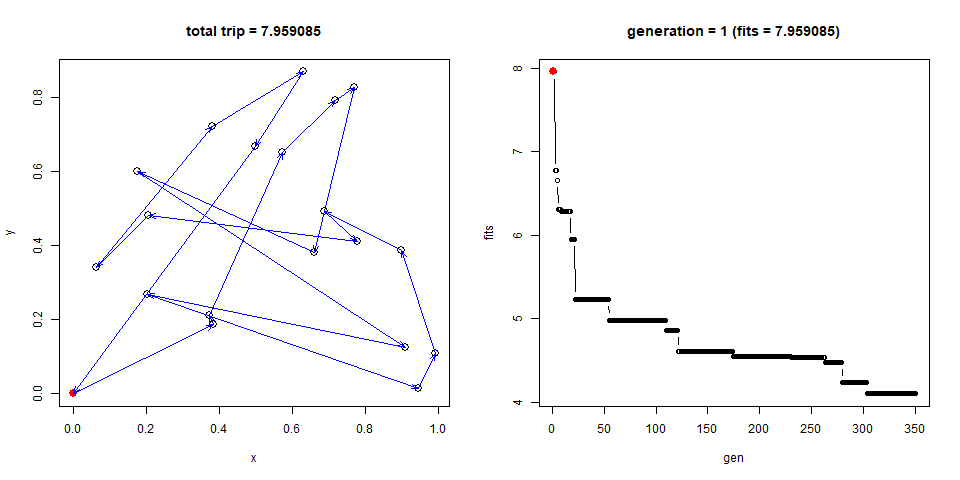

# problem setting

## Travelling salesman problem (TSP)



["Given a list of cities and the distances between each pair of cities, what is the shortest possible route that visits each city and returns to the origin city?" ](https://en.wikipedia.org/wiki/Travelling_salesman_problem)

### location of cities and travel routes


```r
set.seed(7)
setCities <- function(n.cities, mesh = seq(0,1,1e-4)){
  cities <- data.frame(id = 1:n.cities, 
                       x  = sample(mesh, n.cities), 
                       y  = sample(mesh, n.cities))
  cities[1, ] <- data.frame(1,0,0)
  invisible(cities)
}
(cities <- setCities(10))
```

```
##    id      x      y
## 1   1 0.0000 0.0000
## 2   2 0.3977 0.2314
## 3   3 0.1156 0.7727
## 4   4 0.0697 0.0962
## 5   5 0.2436 0.4533
## 6   6 0.7916 0.0846
## 7   7 0.3398 0.5603
## 8   8 0.9714 0.0086
## 9   9 0.1657 0.9850
## 10 10 0.4587 0.3163
```

### represent travel route


```r
# start from id=1
travel <- data.frame(id = c(1, sample(2:NROW(cities)))) %>% 
  left_join(cities, by="id")

travel <- rbind(travel, travel[1, ])
```

### calculate total trip (to be minizimzed)


```r
total.distance <- foreach(i=1:NROW(cities), .combine = sum) %do%({
  from <- travel[i, ]
  to   <-  travel[i+1, ]
  
  distance <- ((from$x - to$x)^2 + (from$y - to$y)^2)^0.5
  return(distance)
})
total.distance
```

```
## [1] 6.012823
```

### sample view: route (travelling orders)


```r
plot(y~x, travel[-1,], cex=1.5, 
     main = sprintf("total trip = %f", total.distance))
points(y~x, data=travel[1,], pch=16, col="red", cex=1.5)
for(i in 1:NROW(cities)){
  
  from <- travel[i, ]
  to <-  travel[i+1, ]
  arrows(x0 = from$x, y0 = from$y, x1 = to$x, y1=to$y, col="blue", 
         length = 0.1, angle = 20)
  
}
```

<!-- -->


# individual

## encodeing

### genetic representation


```r
individual <- function(.cities){
  c(1, sample(2:NROW(.cities)))
}
# example
trip <- individual(cities)
paste0(trip, collapse = "-")
```

```
## [1] "1-5-7-3-8-2-9-4-6-10"
```

### phnotype & fitness


```r
# get total distance
fitness <- function(trip, cities){
  stopifnot(length(trip) == NROW(cities))
  
  travel <- data.frame(id = trip) %>% 
    left_join(cities, by="id")
  
  travel <- rbind(travel, travel[1, ])
  
  total.distance <- foreach(i=1:NROW(cities), .combine = sum) %do%({
    from <- travel[i, ]
    to   <- travel[i+1, ]
    
    distance <- ((from$x - to$x)^2 + (from$y - to$y)^2)^0.5
    return(distance)
  })
  
  return(total.distance)
}
# example
trip <- individual(cities)
fitness(trip, cities)
```

```
## [1] 6.214204
```

## genetic operator

### crossover 

In this case, order-crossover for trip route is applied.


```r
crossover <- function(p1, p2, show.pos = FALSE){
  len_chrom <- length(p1)
  stopifnot(len_chrom >= 3,
            len_chrom == length(p2))
  
  # position at crossover
  at <- sample(2:(length(p1)-1),2)
  at <- sort(at)
  
  child <- rep(NA, length(p1))
  child[1] <- 1
  child[at[1]:at[2]] <- p1[at[1]:at[2]]
  chid.inherit <- child
  
  p2.rot <- p2[c((at[2]+1):length(p2),1:(at[2]))]
  child.omit <- setdiff(p2, child)
  child[which(is.na(child))] <- child.omit
  
  if(show.pos){
    child <- list(at = at, p1 = p1, p2 = p2, 
                  p1.inherit = chid.inherit, p2.rotated = p2.rot,
                  p2.omitted = child.omit, new.chrom = child)
  }
  return(child)
}
# example
chr1 <- individual(cities)
chr2 <- individual(cities)
crossover(chr1, chr2)
```

```
##  [1]  1  3 10  4  5  7  6  9  2  8
```

```r
crossover(chr1, chr2, show.pos = TRUE)
```

```
## $at
## [1] 4 5
## 
## $p1
##  [1]  1  9 10  8  5  7  6  3  4  2
## 
## $p2
##  [1]  1  3 10  4  9  2  8  5  7  6
## 
## $p1.inherit
##  [1]  1 NA NA  8  5 NA NA NA NA NA
## 
## $p2.rotated
##  [1]  2  8  5  7  6  1  3 10  4  9
## 
## $p2.omitted
## [1]  3 10  4  9  2  7  6
## 
## $new.chrom
##  [1]  1  3 10  8  5  4  9  2  7  6
```

### mutation

In this case, inversion (node exchange) is applied as mutation.


```r
# mutation (inversion)
mutation <- function(chrom, mutate.prob =0.05, show.pos = FALSE){
  stopifnot(length(chrom)>3)
  
  for(i in 2:length(chrom)){
    if(runif(1) < mutate.prob){
      base <- setdiff(2:length(chrom), i)
      at <- c(i, sample(base, 1))
      if(show.pos == TRUE){
        cat(sprintf("%i <=> %i \n", at[1], at[2]))
      }
      chrom[at] <- chrom[rev(at)]
    }
  }
  return(chrom)
}
# example
mutation(1:10, mutate.prob = 0.3, show.pos = TRUE)
```

```
## 3 <=> 7 
## 6 <=> 7
```

```
##  [1]  1  2  7  4  5  3  6  8  9 10
```


# population

## simple procedure

init 1st generation -> 2nd generation.


```r
printChroms <- function(l){
  sapply(l, paste0, collapse = "-") %>% tibble()
}
```


```r
POP_SIZE    = 10  # population size
N_ELITE     = 2   # number of elite individual for next chromration
MUTATE_PROB = 0.05 # mutation rate

print(factorial(NROW(cities))) > POP_SIZE
```

```
## [1] 3628800
```

```
## [1] TRUE
```

```r
chrom <- NULL
while(length(chrom) < POP_SIZE){
  new.ind <- individual(cities)
  # print(length(chrom))
  germ <- paste0(new.ind, collapse = "-")
  if(! germ %in% chrom){
    chrom <- c(chrom, list(new.ind))
  }
}

population <- tibble(chrom = chrom)
printChroms(population$chrom)
```

```
## # A tibble: 10 x 1
##    .                   
##    <chr>               
##  1 1-9-10-3-6-8-2-5-7-4
##  2 1-5-4-2-7-8-9-3-10-6
##  3 1-9-3-4-8-7-10-5-2-6
##  4 1-2-8-3-6-9-10-4-7-5
##  5 1-7-8-3-6-4-9-5-2-10
##  6 1-4-8-3-5-2-7-10-9-6
##  7 1-9-7-8-6-5-10-4-3-2
##  8 1-7-4-10-3-6-2-9-5-8
##  9 1-3-10-4-6-8-5-7-9-2
## 10 1-9-6-10-5-4-3-8-2-7
```

```r
population$fits  <- sapply(population$chrom, fitness, cities)
population %<>% arrange(fits)

# Preserve elite individuals
nextInd.elite <- population %>% head(N_ELITE)
nextInd.elite %>% head %>% print()
```

```
## # A tibble: 2 x 2
##   chrom       fits
##   <list>     <dbl>
## 1 <dbl [10]>  5.14
## 2 <dbl [10]>  5.42
```

```r
# Generate children via: selection -> crossover -> mutation
#
pf <- population$fits
roulette.pie <-  (max(pf) -pf) / (max(pf) - min(pf))
roulette.pie <- roulette.pie / sum(roulette.pie)

roulette.pie %>% tibble()
```

```
## # A tibble: 10 x 1
##          .
##      <dbl>
##  1 0.221  
##  2 0.183  
##  3 0.158  
##  4 0.151  
##  5 0.145  
##  6 0.101  
##  7 0.0224 
##  8 0.0123 
##  9 0.00750
## 10 0
```

```r
pie(roulette.pie, clockwise = TRUE,
    main = "roulette based on fitness")
```

<!-- -->

```r
roulette.thr <- cumsum(roulette.pie)
roulette.thr %>% tibble()
```

```
## # A tibble: 10 x 1
##        .
##    <dbl>
##  1 0.221
##  2 0.404
##  3 0.561
##  4 0.712
##  5 0.857
##  6 0.958
##  7 0.980
##  8 0.992
##  9 1.000
## 10 1.000
```

```r
which(roulette.thr > print(x <- runif(1)))[1]
```

```
## [1] 0.3776336
```

```
## [1] 2
```

```r
which(roulette.thr > 0.999)[1]
```

```
## [1] 9
```

```r
#

# selection -> crossover
chrom <- NULL
while(length(chrom) < NROW(population)- NROW(nextInd.elite)){
  p1 <- which(roulette.thr > runif(1))[1]
  p2 <- which(roulette.thr > runif(1))[1]
  while(p1 == p2){
    p2 <- which(roulette.thr > runif(1))[1]
  }

  new.ind <- crossover(population$chrom[p1] %>% unlist,
                       population$chrom[p2] %>% unlist)

  germ <- paste0(new.ind, collapse = "-")
  if(! germ %in% chrom){
    chrom <- c(chrom, list(new.ind))
  }
}
printChroms(chrom)
```

```
## # A tibble: 8 x 1
##   .                   
##   <chr>               
## 1 1-3-10-2-7-8-9-4-6-5
## 2 1-10-3-6-7-8-9-2-5-4
## 3 1-4-6-10-8-3-5-2-7-9
## 4 1-5-4-8-9-2-7-3-10-6
## 5 1-5-10-3-4-2-7-8-9-6
## 6 1-5-4-2-7-8-9-3-10-6
## 7 1-8-7-9-6-5-10-4-3-2
## 8 1-9-3-4-8-10-5-7-2-6
```

```r
# mutation
nextInd.gen <- tibble(
  chrom = lapply(chrom, mutation, mutate.prob = MUTATE_PROB))

all.equal(chrom, nextInd.gen$chrom)
```

```
## [1] "Component 1: Mean relative difference: 0.1176471"
## [2] "Component 6: Mean relative difference: 0.4"
```

```r
cbind(chrom = printChroms(chrom), nextInd = printChroms(nextInd.gen$chrom))
```

```
##                      .                    .
## 1 1-3-10-2-7-8-9-4-6-5 1-3-10-2-7-9-8-4-6-5
## 2 1-10-3-6-7-8-9-2-5-4 1-10-3-6-7-8-9-2-5-4
## 3 1-4-6-10-8-3-5-2-7-9 1-4-6-10-8-3-5-2-7-9
## 4 1-5-4-8-9-2-7-3-10-6 1-5-4-8-9-2-7-3-10-6
## 5 1-5-10-3-4-2-7-8-9-6 1-5-10-3-4-2-7-8-9-6
## 6 1-5-4-2-7-8-9-3-10-6 1-5-4-3-7-8-9-2-10-6
## 7 1-8-7-9-6-5-10-4-3-2 1-8-7-9-6-5-10-4-3-2
## 8 1-9-3-4-8-10-5-7-2-6 1-9-3-4-8-10-5-7-2-6
```

```r
population <- bind_rows(nextInd.elite, nextInd.gen)
population$fits  <- sapply(population$chrom, fitness, cities)
population %<>% arrange(fits)

population
```

```
## # A tibble: 10 x 2
##    chrom       fits
##    <list>     <dbl>
##  1 <dbl [10]>  5.14
##  2 <dbl [10]>  5.35
##  3 <dbl [10]>  5.40
##  4 <dbl [10]>  5.42
##  5 <dbl [10]>  6.10
##  6 <dbl [10]>  6.29
##  7 <dbl [10]>  6.32
##  8 <dbl [10]>  6.43
##  9 <dbl [10]>  6.48
## 10 <dbl [10]>  6.70
```

## functionise

### initialize 1st generation  


```r
initPopulation <- function(pop.size, .cities){
  stopifnot(factorial(NROW(.cities)) > pop.size)
  
  chrom <- NULL
  while(length(chrom) < pop.size){
    new.ind <- individual(.cities)
    # print(length(chrom))
    germ <- paste0(new.ind, collapse = "-")
    if(! germ %in% chrom){
      chrom <- c(chrom, list(new.ind))
    }
  }
  population <- tibble(chrom = chrom)
  population$fits  <- sapply(population$chrom, fitness, .cities)
  
  return(population %>% arrange(fits))
}
# example
pop <- initPopulation(20, cities)
printChroms(pop$chrom)
```

```
## # A tibble: 20 x 1
##    .                   
##    <chr>               
##  1 1-10-5-2-6-8-9-3-7-4
##  2 1-4-2-8-7-6-10-5-3-9
##  3 1-2-3-9-4-10-7-5-8-6
##  4 1-5-3-4-8-6-7-9-2-10
##  5 1-5-8-4-2-6-7-3-9-10
##  6 1-10-3-5-4-7-2-8-6-9
##  7 1-10-7-6-8-3-4-2-5-9
##  8 1-8-6-4-9-2-5-3-10-7
##  9 1-9-2-7-3-6-8-4-10-5
## 10 1-3-5-2-8-4-9-7-10-6
## 11 1-4-9-6-2-7-3-10-5-8
## 12 1-5-7-2-3-8-10-6-9-4
## 13 1-4-2-8-9-10-7-5-6-3
## 14 1-6-3-9-2-5-8-4-10-7
## 15 1-6-3-5-7-8-4-10-2-9
## 16 1-7-3-6-9-4-10-2-8-5
## 17 1-8-7-2-10-4-3-5-6-9
## 18 1-3-10-4-9-5-8-2-7-6
## 19 1-9-10-7-8-4-3-6-5-2
## 20 1-2-5-6-3-8-7-10-4-9
```

### alternate to next generation


```r
alternate <- function(population,  .cities, elite.size, mutate.prob = 0.3){
  stopifnot(!missing(population), !missing(.cities), 
            NROW(population) > elite.size )
  
  # Preserve elite individuals
  nextInd.elite <- population %>% 
    arrange(fits) %>% 
    head(elite.size)

  # Generate children via: selection -> crossover -> mutation
  # roulette source based on fitness for selection
  pf <- population$fits
  roulette.pie <-  (max(pf) -pf) / (max(pf) - min(pf)) 
  roulette.pie <- roulette.pie / sum(roulette.pie)
  roulette.thr <- cumsum(roulette.pie)
  
  # selection -> crossover
  chrom <- NULL
  while(length(chrom) < NROW(population) - NROW(nextInd.elite)){
    p1 <- which(roulette.thr > runif(1))[1]
    p2 <- which(roulette.thr > runif(1))[1]
    while(p1 == p2){
      p2 <- which(roulette.thr > runif(1))[1]
    }
    
    new.ind <- crossover(population$chrom[p1] %>% unlist,
                         population$chrom[p2] %>% unlist)
    
    germ <- paste0(new.ind, collapse = "-")
    if(! germ %in% chrom){
      chrom <- c(chrom, list(new.ind))
    }
  }

  # mutation
  nextInd.gen <- tibble(
    chrom = lapply(chrom, mutation, mutate.prob = mutate.prob))

  population <- bind_rows(nextInd.elite, nextInd.gen)
  population$fits  <- sapply(population$chrom, fitness, .cities)
  
  return(population %>% arrange(fits))
}
# example
(pop <- initPopulation(30, cities))
```

```
## # A tibble: 30 x 2
##    chrom       fits
##    <list>     <dbl>
##  1 <dbl [10]>  4.65
##  2 <dbl [10]>  4.77
##  3 <dbl [10]>  5.12
##  4 <dbl [10]>  5.16
##  5 <dbl [10]>  5.17
##  6 <dbl [10]>  5.17
##  7 <dbl [10]>  5.20
##  8 <dbl [10]>  5.38
##  9 <dbl [10]>  5.48
## 10 <dbl [10]>  5.50
## # ... with 20 more rows
```

```r
(pop.new <- alternate(pop, cities, elite.size = 3, mutate.prob = 0.8))
```

```
## # A tibble: 30 x 2
##    chrom       fits
##    <list>     <dbl>
##  1 <dbl [10]>  4.54
##  2 <dbl [10]>  4.65
##  3 <dbl [10]>  4.76
##  4 <dbl [10]>  4.77
##  5 <dbl [10]>  4.81
##  6 <dbl [10]>  5.12
##  7 <dbl [10]>  5.27
##  8 <dbl [10]>  5.27
##  9 <dbl [10]>  5.37
## 10 <dbl [10]>  5.48
## # ... with 20 more rows
```

### plot trip route


```r
plot.trip <- function(trip, .cities){
  stopifnot(!missing(trip),
            !missing(.cities), 
            NROW(.cities) == length(trip))
  travel <- data.frame(id = trip) %>% 
    left_join(.cities, by="id")
  travel <- rbind(travel, travel[1, ])
  # print(trip)
  # print(travel)
  
  total.distance <- fitness(trip, .cities)
  # print(total.distance)
  
  # plot travelling orders
  plot(y~x, travel[-1,], cex=1.5, 
       main = sprintf("total trip = %f", total.distance))
  points(y~x, data=travel[1, ], pch=16, col="red", cex=1.5)
  for(i in 1:NROW(.cities)){
    from <- travel[i, ]
    to   <- travel[i+1, ]
    arrows(x0 = from$x, y0 = from$y, x1 = to$x, y1=to$y, col="blue", 
           length = 0.1, angle = 20)
  }
}
# example
sample.trip <- individual(cities)
fitness(sample.trip, cities)
```

```
## [1] 4.634169
```

```r
plot.trip(sample.trip, cities)
```

<!-- -->


# example 1
## exec

```r
set.seed(7)
N_CITIES    = 10  # number of cities to travel
GEN_MAX     = 15  # number of generation
POP_SIZE    = 50  # population size
N_ELITE     = 3   # number of elite individual for next chromration
MUTATE_PROB = 0.1# mutation rate

factorial(N_CITIES)
```

```
## [1] 3628800
```


```r
start_time <- Sys.time()

(cities <- setCities(N_CITIES))
sample.trip <- individual(cities)
plot.trip(sample.trip, cities)
```

<!-- -->

```r
generation <- list(NULL)

(pop <- initPopulation(POP_SIZE, cities))
for(i in 1:GEN_MAX){
  print(i)
  generation[[i]] <- pop
  pop <- alternate(pop,  cities, 
                   elite.size  = N_ELITE, 
                   mutate.prob = MUTATE_PROB)
}
Sys.time() - start_time
```


## eval


```r
top1 <- NULL
for(i in 1:length(generation)){
  this <- generation[[i]]
  top1 <- rbind(top1, tibble(gen=i, 
                             chrom = this$chrom[1], 
                             fits  = this$fits[1]))
}
top1
```

```
## # A tibble: 50 x 3
##      gen chrom       fits
##    <int> <list>     <dbl>
##  1     1 <dbl [10]>  4.71
##  2     2 <dbl [10]>  4.41
##  3     3 <dbl [10]>  4.41
##  4     4 <dbl [10]>  4.07
##  5     5 <dbl [10]>  4.01
##  6     6 <dbl [10]>  4.01
##  7     7 <dbl [10]>  4.01
##  8     8 <dbl [10]>  4.01
##  9     9 <dbl [10]>  3.64
## 10    10 <dbl [10]>  3.64
## # ... with 40 more rows
```

## plot animation


```r
library(animation)
saveGIF({
  
  for(g in 1:length(generation)){
    par(mfrow = c(1,2))
    
    this.trip <- unlist(top1$chrom[g])
    plot.trip(this.trip, cities)
    
    plot(fits~gen, top1, type="b",
         main = sprintf("generation = %i (fits = %f)", g, top1$fits[g]))
    points(x=g, y=top1$fits[g], pch=16, col="red", cex=1.5)
    # top1;max(Y)
    
    par(mfrow = c(1,1))
  }
}, movie.name = "./output/stepGA_10cities-50steps.gif", 
interval = 1, ani.width=960, ani.height=480)
```


# example 2 (large ver.)
## exec

```r
set.seed(1)
N_CITIES    = 20  # number of cities to travel
GEN_MAX     = 350  # number of generation
POP_SIZE    = 150  # population size
N_ELITE     = 5   # number of elite individual for next chromration
MUTATE_PROB = 0.05 # mutation rate

factorial(N_CITIES)
```

```
## [1] 2.432902e+18
```


```r
start_time <- Sys.time()

(cities.L <- setCities(N_CITIES))

generation.L <- list(NULL)
(pop <- initPopulation(POP_SIZE, cities.L))
for(i in 1:GEN_MAX){
  print(i)
  generation.L[[i]] <- pop
  pop <- alternate(pop,  cities.L, 
                   elite.size  = N_ELITE, 
                   mutate.prob = MUTATE_PROB)
}
Sys.time() - start_time
```

## eval & plot animation


```r
top1.L <- NULL
for(i in 1:length(generation.L)){
  this <- generation.L[[i]]
  top1.L <- rbind(top1.L, tibble(gen=i, 
                             chrom = this$chrom[1], 
                             fits  = this$fits[1]))
}

saveGIF({
  
  for(g in 1:length(generation.L)){
    par(mfrow = c(1,2))
    
    this.trip <- unlist(top1.L$chrom[g])
    plot.trip(this.trip, cities.L)
    
    plot(fits~gen, top1.L, type="b",
         main = sprintf("generation = %i (fits = %f)", g, top1.L$fits[g]))
    points(x=g, y=top1.L$fits[g], pch=16, col="red", cex=1.5)
    # top1;max(Y)
    
    par(mfrow = c(1,1))
  }
}, movie.name = "./output/stepGA_20cities.gif", 
interval = 0.1, ani.width=960, ani.height=480)
```

```
## Executing: 
## "convert -loop 0 -delay 10 Rplot1.png Rplot2.png Rplot3.png
##     Rplot4.png Rplot5.png Rplot6.png Rplot7.png Rplot8.png
##     Rplot9.png Rplot10.png Rplot11.png Rplot12.png Rplot13.png
##     Rplot14.png Rplot15.png Rplot16.png Rplot17.png Rplot18.png
##     Rplot19.png Rplot20.png Rplot21.png Rplot22.png Rplot23.png
##     Rplot24.png Rplot25.png Rplot26.png Rplot27.png Rplot28.png
##     Rplot29.png Rplot30.png Rplot31.png Rplot32.png Rplot33.png
##     Rplot34.png Rplot35.png Rplot36.png Rplot37.png Rplot38.png
##     Rplot39.png Rplot40.png Rplot41.png Rplot42.png Rplot43.png
##     Rplot44.png Rplot45.png Rplot46.png Rplot47.png Rplot48.png
##     Rplot49.png Rplot50.png Rplot51.png Rplot52.png Rplot53.png
##     Rplot54.png Rplot55.png Rplot56.png Rplot57.png Rplot58.png
##     Rplot59.png Rplot60.png Rplot61.png Rplot62.png Rplot63.png
##     Rplot64.png Rplot65.png Rplot66.png Rplot67.png Rplot68.png
##     Rplot69.png Rplot70.png Rplot71.png Rplot72.png Rplot73.png
##     Rplot74.png Rplot75.png Rplot76.png Rplot77.png Rplot78.png
##     Rplot79.png Rplot80.png Rplot81.png Rplot82.png Rplot83.png
##     Rplot84.png Rplot85.png Rplot86.png Rplot87.png Rplot88.png
##     Rplot89.png Rplot90.png Rplot91.png Rplot92.png Rplot93.png
##     Rplot94.png Rplot95.png Rplot96.png Rplot97.png Rplot98.png
##     Rplot99.png Rplot100.png Rplot101.png Rplot102.png
##     Rplot103.png Rplot104.png Rplot105.png Rplot106.png
##     Rplot107.png Rplot108.png Rplot109.png Rplot110.png
##     Rplot111.png Rplot112.png Rplot113.png Rplot114.png
##     Rplot115.png Rplot116.png Rplot117.png Rplot118.png
##     Rplot119.png Rplot120.png Rplot121.png Rplot122.png
##     Rplot123.png Rplot124.png Rplot125.png Rplot126.png
##     Rplot127.png Rplot128.png Rplot129.png Rplot130.png
##     Rplot131.png Rplot132.png Rplot133.png Rplot134.png
##     Rplot135.png Rplot136.png Rplot137.png Rplot138.png
##     Rplot139.png Rplot140.png Rplot141.png Rplot142.png
##     Rplot143.png Rplot144.png Rplot145.png Rplot146.png
##     Rplot147.png Rplot148.png Rplot149.png Rplot150.png
##     Rplot151.png Rplot152.png Rplot153.png Rplot154.png
##     Rplot155.png Rplot156.png Rplot157.png Rplot158.png
##     Rplot159.png Rplot160.png Rplot161.png Rplot162.png
##     Rplot163.png Rplot164.png Rplot165.png Rplot166.png
##     Rplot167.png Rplot168.png Rplot169.png Rplot170.png
##     Rplot171.png Rplot172.png Rplot173.png Rplot174.png
##     Rplot175.png Rplot176.png Rplot177.png Rplot178.png
##     Rplot179.png Rplot180.png Rplot181.png Rplot182.png
##     Rplot183.png Rplot184.png Rplot185.png Rplot186.png
##     Rplot187.png Rplot188.png Rplot189.png Rplot190.png
##     Rplot191.png Rplot192.png Rplot193.png Rplot194.png
##     Rplot195.png Rplot196.png Rplot197.png Rplot198.png
##     Rplot199.png Rplot200.png Rplot201.png Rplot202.png
##     Rplot203.png Rplot204.png Rplot205.png Rplot206.png
##     Rplot207.png Rplot208.png Rplot209.png Rplot210.png
##     Rplot211.png Rplot212.png Rplot213.png Rplot214.png
##     Rplot215.png Rplot216.png Rplot217.png Rplot218.png
##     Rplot219.png Rplot220.png Rplot221.png Rplot222.png
##     Rplot223.png Rplot224.png Rplot225.png Rplot226.png
##     Rplot227.png Rplot228.png Rplot229.png Rplot230.png
##     Rplot231.png Rplot232.png Rplot233.png Rplot234.png
##     Rplot235.png Rplot236.png Rplot237.png Rplot238.png
##     Rplot239.png Rplot240.png Rplot241.png Rplot242.png
##     Rplot243.png Rplot244.png Rplot245.png Rplot246.png
##     Rplot247.png Rplot248.png Rplot249.png Rplot250.png
##     Rplot251.png Rplot252.png Rplot253.png Rplot254.png
##     Rplot255.png Rplot256.png Rplot257.png Rplot258.png
##     Rplot259.png Rplot260.png Rplot261.png Rplot262.png
##     Rplot263.png Rplot264.png Rplot265.png Rplot266.png
##     Rplot267.png Rplot268.png Rplot269.png Rplot270.png
##     Rplot271.png Rplot272.png Rplot273.png Rplot274.png
##     Rplot275.png Rplot276.png Rplot277.png Rplot278.png
##     Rplot279.png Rplot280.png Rplot281.png Rplot282.png
##     Rplot283.png Rplot284.png Rplot285.png Rplot286.png
##     Rplot287.png Rplot288.png Rplot289.png Rplot290.png
##     Rplot291.png Rplot292.png Rplot293.png Rplot294.png
##     Rplot295.png Rplot296.png Rplot297.png Rplot298.png
##     Rplot299.png Rplot300.png Rplot301.png Rplot302.png
##     Rplot303.png Rplot304.png Rplot305.png Rplot306.png
##     Rplot307.png Rplot308.png Rplot309.png Rplot310.png
##     Rplot311.png Rplot312.png Rplot313.png Rplot314.png
##     Rplot315.png Rplot316.png Rplot317.png Rplot318.png
##     Rplot319.png Rplot320.png Rplot321.png Rplot322.png
##     Rplot323.png Rplot324.png Rplot325.png Rplot326.png
##     Rplot327.png Rplot328.png Rplot329.png Rplot330.png
##     Rplot331.png Rplot332.png Rplot333.png Rplot334.png
##     Rplot335.png Rplot336.png Rplot337.png Rplot338.png
##     Rplot339.png Rplot340.png Rplot341.png Rplot342.png
##     Rplot343.png Rplot344.png Rplot345.png Rplot346.png
##     Rplot347.png Rplot348.png Rplot349.png Rplot350.png
##     "stepGA_20cities.gif""
```

```
## Output at: ./output/stepGA_20cities.gif
```

```
## [1] TRUE
```


